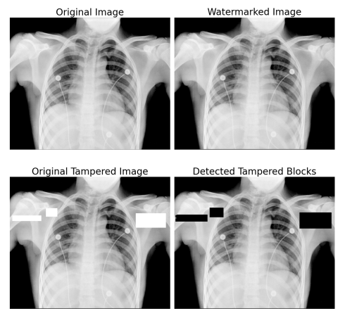

# Image-Tampering-Detection-via-Steganographic-Watermarking
UCSD ECE253 Digital Image Processing Project

## References
[Multipurpose Image Watermarking: Ownership Check,
Tamper Detection and Self-recovery](ref/multipurpose.pdf)

## Team Member
@akane0721  
@pec020  
@ShawnCai223     

## Modules
**Fragile Watermark**: &nbsp;&nbsp;Pixel Modification  
**Robust Watermark**: &nbsp;&nbsp;Discrete Wavelet Transform (DWT)  
**Image Recovery**: &nbsp;&nbsp;Adaptive Neighborhood Block Averaging (ANBA) Algorithm  
**Simulation and Examination**: &nbsp;&nbsp;PSNR, SSIM, BER, etc.   

| Image | PSNR* | SSIM*  | BER    | TDeff | PSNR** | SSIM**  |
|-------|-------|--------|--------|-------|--------|---------|
| 1     | 38.92 | 0.9918 | 0.1170 | 93.32 | 35.69  | 0.9857  |
| 2     | 45.90 | 0.9963 | 0.0574 | 97.01 | 28.73  | 0.9115  |
| 3     | 45.92 | 0.9949 | 0.1945 | 93.07 | 42.03  | 0.9884  |
| 4     | 44.31 | 0.9966 | 0.2201 | 93.09 | 36.23  | 0.9818  |
| 5     | 45.90 | 0.9980 | 0.1795 | 93.06 | 35.93  | 0.9826  |
| 6     | 45.91 | 0.9962 | 0.1664 | 92.12 | 39.94  | 0.9860  |
| 7     | 45.89 | 0.9957 | 0.2205 | 94.26 | 36.59  | 0.9782  |
| 8     | 32.64 | 0.9637 | 0.1378 | 90.34 | 32.35  | 0.9589  |
| 9     | 30.75 | 0.9873 | 0.1319 | 92.31 | 38.56  | 0.9863  |

\* represent PSNR and SSIM results for watermarked images.  
\** represent PSNR and SSIM results for recovered images.
